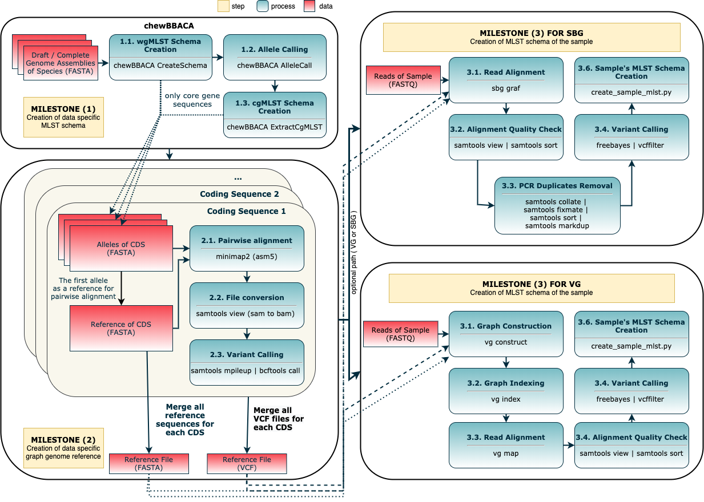

<div align="left"> <h1>  MILESTONE </h1> </div>

<!-- MarkdownTOC -->

- Preprocess
  - Downloading NCBI data to create the reference genome for given species
- Install conda environment
- Creation of reference genome
- Creation of CDS FASTA file of the given sample
- Creation of MLST schema of the given sample

<!-- /MarkdownTOC -->

---

Milestone is an end-to-end sample-based cgMLST profile creation workflow for given bacterial species. It only uses available genome assemblies of the species provided by the user or NCBI's public database, and raw reads of the given sample.

## Preprocess

### Downloading NCBI data to create the reference genome for given species

- `$ >> bash download_species_reference_fasta.sh -s <species_name>`

---

## Install conda environment

```bash
$ >> conda config --add channels defaults
$ >> conda config --add channels bioconda
$ >> conda config --add channels conda-forge
$ >> conda create -n milestone chewbbaca=2.7 freebayes=1.3.1 minimap2=2.17 snakemake=5.32.1
```

- Activate the created environment: `$ >> source activate milestone`
- Deactivate the created environment: `$ >> source deactivate milestone`
- Remove the created environment: `$ >> conda env remove milestone`

## Install VG

@todo

---



## Creation of reference genome

> python milestone.py chewbbaca -d <input_data_directory> -t <number_of_threads> -g <reference_genome_assemblies_directory> -p -r <to_be_created_reference_file_name_without_extension> --snakefile Snakefile -F

@ delete this part later

> python milestone.py chewbbaca -d . -t 8 -g schema_ref_fasta -p -r reference --snakefile Snakefile -F

## Creation of MLST schema of the given sample and update reference genome

> python milestone.py mlst -d <input_data_directory> -t <number_of_threads> -p -r <to_be_created_reference_file_name_without_extension> -e <sample_1.fastq> -E <sample_2.fastq> --aligner <vg/sbg> --snakefile Snakefile --sample-mlst -F

@ delete this part later
> python milestone.py mlst -d . -t 8 -p -r reference -e ERR3464558_1.fastq -E ERR3464558_2.fastq --aligner vg --snakefile Snakefile -F

- [ ] @todo Add create_allele_info.py to milestone pipeline


## To-do

- [ ] `$ >> pip install milestone`
- [ ] `$ >> conda install milestone`
- [ ] `$ >> docker pull milestone`
- [ ] Prepared MLST from chewie-NS: https://chewbbaca.online/stats 