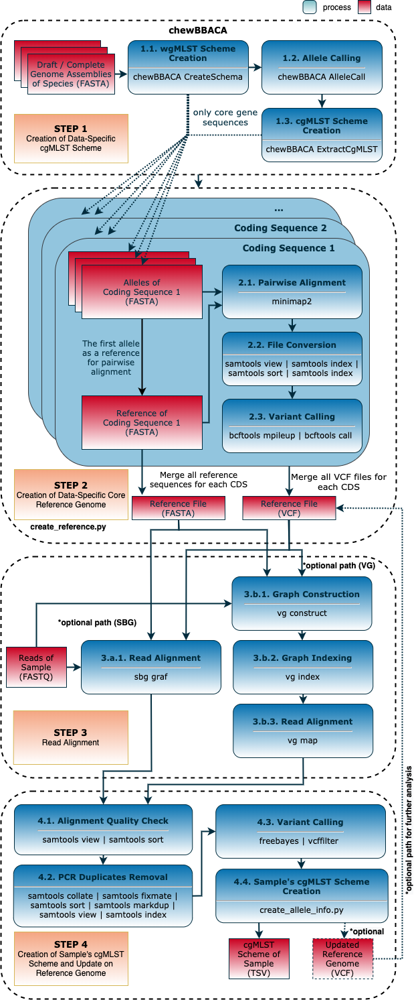
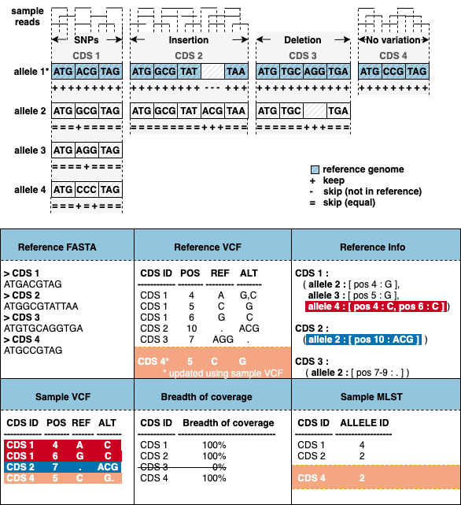

<div align="left"> <h1>  MILESTONE </h1> </div>

## Table of Contents

<!-- MarkdownTOC -->

- Preprocess
    - Downloading NCBI data to create the reference genome for given species
- Install conda environment
- Install VG
- Creation of reference genome
- Creation of MLST schema of the given sample and update reference genome
- Creates sample's mlst without updating reference files
- Creates sample's mlst and updates reference files

<!-- /MarkdownTOC -->

---

Milestone is an end-to-end sample-based cgMLST profile creation workflow for given bacterial species. It only uses available genome assemblies of the species provided by the user or NCBI's public database, and raw reads of the given sample.

## Preprocess

### Downloading NCBI data to create the reference genome for given species

- `$ >> bash download_species_reference_fasta.sh -s <species_name>`

---

## Install conda environment

```bash
$ >> conda config --add channels defaults
$ >> conda config --add channels bioconda
$ >> conda config --add channels conda-forge
$ >> conda create --name milestone chewbbaca=2.7 freebayes=1.3 minimap2=2.17 snakemake=5.32 pysam=0.16 bcftools=1.12
```

- Activate the created environment: `$ >> source activate milestone`
- Deactivate the created environment: `$ >> source deactivate milestone`

## Install VG

@todo

---






## Creation of reference genome

`$ >> python milestone.py chewbbaca -d <input_data_directory> -t <number_of_threads> -g <reference_genome_assemblies_directory> -p -r <to_be_created_reference_file_name_without_extension> --snakefile Snakefile -F`

## Creation of MLST schema of the given sample and update reference genome

#### 1. Creates sample's mlst without updating reference files

`$ >> python milestone.py mlst -d <input_data_directory> -t <number_of_threads> -p -r <to_be_created_reference_file_name_without_extension> -e <sample_1.fastq> -E <sample_2.fastq> --aligner <vg/sbg> --snakefile Snakefile -F`

#### 2. Creates sample's mlst and updates reference files

`$ >> python milestone.py mlst -d <input_data_directory> -t <number_of_threads> -p -r <to_be_created_reference_file_name_without_extension> -e <sample_1.fastq> -E <sample_2.fastq> --aligner <vg/sbg> --snakefile Snakefile --update_reference -F`

