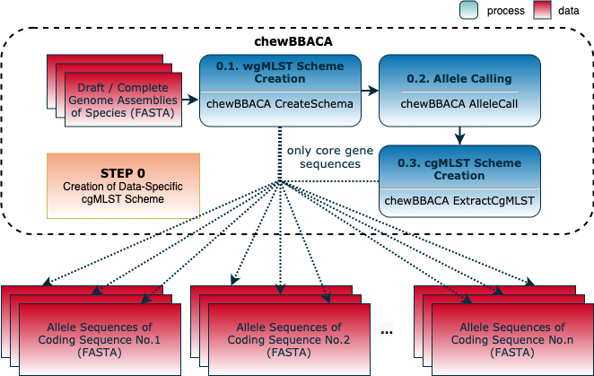
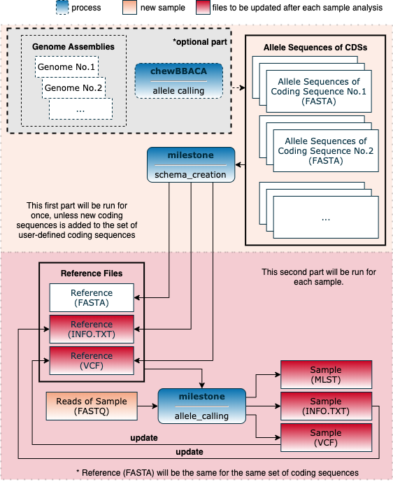
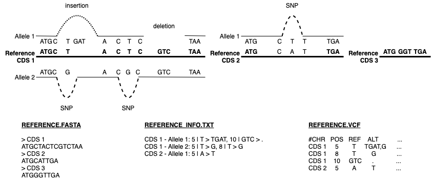

<div align="left"> <h1>  MILESTONE </h1> </div>

Milestone is an end-to-end sample-based MLST profile creation workflow for bacterial species.

## Table of Contents

<!-- MarkdownTOC -->

- Tutorial
- 0. Setting up the analysis
  - 0.1. Creating conda environment \(optional\)
  - 0.1.1. Installing conda environment \(optional\)
- Milestone Workflow
- 0. Schema creation for the set of core CDSs
- 1. Schema creation for the set of user-defined CDSs
  - Creation of reference info
  - Reference update after each sample analysis
  - Graph Representation in Reference Files
    - Milestone commands
  - Citation

<!-- /MarkdownTOC -->


## Tutorial

## 0. Setting up the analysis

- **Downloading data from NCBI (optional):** `bash download_species_reference_fasta.sh -s <species_name>`

### 0.1. Creating conda environment (optional)

- **pip installation:** `sudo apt install python-pip`
- **dependencies:** _requirements.txt_, python 3.8.10
- **conda installation:** `pip install conda`

### 0.1.1. Installing conda environment (optional)

```bash
conda config --add channels defaults
conda config --add channels bioconda
conda config --add channels conda-forge
conda create --name milestone bcftools=1.13 biopython=1.79 chewbbaca=2.7.0 htslib=1.13 fastp=0.12.4 freebayes=1.3.2 minimap2=2.17 pysam=0.16.0.1 samtools=1.13 snakemake=5.32.2 vg=1.34
```

- VG only have installation via conda for Linux.
- For macOS, you need to delete `vg=1.34` from the command above and install VG to your local by following the steps in https://github.com/vgteam/vg#building-on-macos as an additional step.

- You can activate the created environment to work in it:
  - `source activate milestone`

- When your analysis is done, you can deactivate the created environment:
  - `conda deactivate`
  - Your environment will be kept unless you remove it. You can use it again by activating with the line given above.

## Milestone Workflow
## 0. Schema creation for the set of core CDSs

@todo




## 1. Schema creation for the set of user-defined CDSs

@todo


---

### Creation of reference info


@todo

---

### Reference update after each sample analysis



@todo

---

### Graph Representation in Reference Files



---

##### Milestone commands

---

**1. Snakemake parameters for both schema_creation and allele_calling`**

-  `-n, --dryrun, --dry-run`

  Do not execute anything, and display what would be done. If you have a very large workflow, use `--dry-run --quiet` to just print a summary of the DAG of jobs.

- `-p, --printshellcmds`

  Print out the shell commands that will be executed.

- `-s SNAKEFILE, --snakefile SNAKEFILE` 

  The workflow definition in form of a snakefile. Usually, you should not need to specify this. By default, Snakemake will search for 'Snakefile','snakefile', 'workflow/Snakefile', 'workflow/snakefile' beneath the current working directory, in this order. Only if you definitely want a different layout, you need to use this parameter.

- `-t THREADS, --threads THREADS, --set-threads THREADS`

  Overwrite thread usage of rules. This allows to fine-tune workflow parallelization. In particular, this is helpful to target certain cluster nodes by e.g. shifting a rule to use more, or less threads than defined in the workflow. Thereby, THREADS has to be a positive integer, and RULE has to be the name of the rule.

- `-F, --forceall`

  Force the execution of the selected (or the first) rule and all rules it is dependent on regardless of already created output.

- `--ri, --rerun-incomplete`

  Re-run all jobs the output of which is recognized as incomplete.

- `--unlock`

  Remove a lock on the working directory.

- `-q, --quiet`

  Do not output any progress or rule information.
  
  

---

**2. schema_creation parameters**

`python milestone.py schema_creation [-h] [-n] [-p] [-s SNAKEFILE] [-t THREADS] [-F] [--ri] [--unlock] [-q] -r REFERENCE -o OUTPUT -g GENOME_DIR [-mt MLST_TYPE]`

- `-h, --help`

  Show the instructions.

- `-r REFERENCE, --reference REFERENCE`

  Name of reference file to be given without extension and directory. (Both VCF and FASTA file name of the reference.)

- `-o OUTPUT, --output OUTPUT`

  Directory to be created for the output files

- `-g GENOME_DIR, --genome_dir GENOME_DIR`

  Assembled genome directory name to create schema

- `-mt MLST_TYPE, --mlst_type MLST_TYPE`

  Create sample's cgMLST or ugMLST (-mt cg or -mt ug or --mlst_type cg or --mlst_type ug)
  
  

---

**3. allele_calling parameters**

`milestone.py allele_calling [-h] [-n] [-p] [-s SNAKEFILE] [-t THREADS] [-F] [--ri] [--unlock] [-q] -r REFERENCE -o OUTPUT [--aligner ALIGNER] -e READ1 -E READ2 [--ur]`

- `-h, --help`

  Show the instructions.

- `-r REFERENCE, --reference REFERENCE`

  Name of reference file to be given without extension and directory. (Both VCF and FASTA file name of the reference.)

- `-o OUTPUT, --output OUTPUT`

  Directory to be created for the output files

- `--aligner ALIGNER`

  Allele Calling and Reference Update - Graph Aligner option, sbg or vg. (default: vg)

- `-e READ1, --read1 READ1`

  Allele Calling and Reference Update - Sample first read including its directory

- `-E READ2, --read2 READ2`

  Allele Calling and Reference Update - Sample second read including its directory

-  `--ur, --update_reference`

  Allele Calling and Reference Update - Update <reference_info.txt> and <reference.vcf> after the alignment of the given sample.

### Citation

@todo
