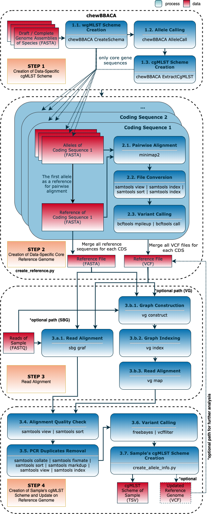
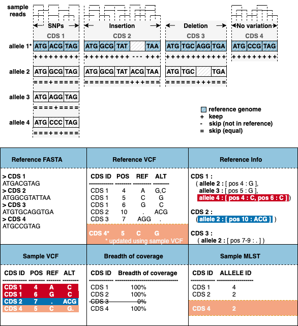

<div align="left"> <h1>  MILESTONE </h1> </div>

## Table of Contents

<!-- MarkdownTOC -->

- Preprocess
    - Downloading NCBI data to create the reference genome for given species
- Install conda environment
- Install VG
- Creation of reference genome
- Creation of MLST schema of the given sample and update reference genome
- Creates sample's mlst without updating reference files
- Creates sample's mlst and updates reference files

<!-- /MarkdownTOC -->

---

Milestone is an end-to-end sample-based cgMLST profile creation workflow for bacterial species. It only requires genome assemblies to create reference genome for the species. In case of the lack of assemblies for the bacterial species to be analyzed, you can download from NCBI's public database to create reference genome for the species.

## 0. Setting up the analysis

#### Dependencies (requirements.txt)

- chewbbaca=2.7
- freebayes=1.3
- minimap2=2.17
- snakemake=5.32
- pysam=0.16
- bcftools=1.12
- vg=1.33

### 0.1. Downloading data from NCBI (optional)

`bash download_species_reference_fasta.sh -s <species_name>`

### 0.2. Creating conda environment (optional)

- pip installation:

  `sudo apt install python-pip`

- conda installation:

  `pip install conda`

### 0.2.1. Install the environment

```bash
conda config --add channels defaults
conda config --add channels bioconda
conda config --add channels conda-forge
conda create --name milestone chewbbaca=2.7 freebayes=1.3 minimap2=2.17 snakemake=5.32 pysam=0.16 bcftools=1.12
conda install -c bioconda vg=1.33 # only for Linux
```

- VG only have installation via conda for Linux so you can directly install it using the last command.
- For macOS, you need to skip the last command and install VG to your local by following the steps in https://github.com/vgteam/vg#building-on-macos as an additional step.

- You can activate the created environment to work in it:
  - `conda activate milestone`

- When your analysis is done, you can deactivate the created environment:
  - `conda deactivate milestone`
  - Your environment will be kept unless you remove it. You can use it again by activating with the line given above.

## Milestone



---

### STEP 1 and 2 - *milestone.py chewbbaca*: Creation of reference genome



**Usage**

`python milestone.py chewbbaca [-h] [-n] [-p] [-s SNAKEFILE] [-t THREADS] [-F] [--ri] [--unlock] [-q] -r REFERENCE -o OUTPUT -g GENOME_DIR`

**Parameters**

 `-h, --help` Show this help message and exit.

**1. Snakemake parameters**

` -n, --dryrun, --dry-run` Do not execute anything, and display what would be done. If you have a very large workflow, use --dry-run --quiet to just print a summary of the DAG of jobs.

`-p, --printshellcmds` Print out the shell commands that will be executed.

` -s SNAKEFILE, --snakefile SNAKEFILE` The workflow definition in form of a snakefile. Usually, you should not need to specify this. By default, Snakemake will search for 'Snakefile','snakefile', 'workflow/Snakefile', 'workflow/snakefile' beneath the current working directory, in this order. Only if you definitely want a different layout, you need to use this parameter.

 `-t THREADS, --threads THREADS, --set-threads THREADS` Overwrite thread usage of rules. This allows to fine-tune workflow parallelization. In particular, this is helpful to target certain cluster nodes by e.g. shifting a rule to use more, or less threads than defined in the workflow. Thereby, THREADS has to be a positive integer, and RULE has to be the name of the rule.

`-F, --forceall` Force the execution of the selected (or the first) rule and all rules it is dependent on regardless of already created output.

 `--ri, --rerun-incomplete` Re-run all jobs the output of which is recognized as incomplete.

 `--unlock` Remove a lock on the working directory.

`-q, --quiet` Do not output any progress or rule information.

**2. milestone parameters**

 `-r REFERENCE, --reference REFERENCE` Name of reference file to be given without extension and directory. (Both VCF and FASTA file name of the reference.)

`-o OUTPUT, --output OUTPUT` Directory to be created for the output files.

 `-g GENOME_DIR, --genome_dir GENOME_DIR` ChewBBACA - Assembled genome directory name to create species MLST schema

---

### STEP 3 and 4 - *milestone.py mlst*: Creation of MLST schema of the given sample and update reference genome

**Usage**

`python milestone.py mlst [-h] [-n] [-p] [-s SNAKEFILE] [-t THREADS] [-F] [--ri] [--unlock] [-q] -r REFERENCE -o OUTPUT [--aligner ALIGNER] -e READ1 -E READ2 [--ur]`

**Parameters**

`-h, --help` Show this help message and exit

**1. Snakemake parameters**

`-n, --dryrun, --dry-run` Do not execute anything, and display what would be done. If you have a very large workflow, use --dry-run --quiet to just print a summary of the DAG of jobs.

`-p, --printshellcmds` Print out the shell commands that will be executed.

`-s SNAKEFILE, --snakefile SNAKEFILE` The workflow definition in form of a snakefile. Usually, you should not need to specify this. By default, Snakemake will search for  'Snakefile','snakefile', 'workflow/Snakefile', 'workflow/snakefile' beneath the current working directory, in this order. Only if you definitely want a different layout, you need to use this parameter.

`-t THREADS, --threads THREADS, --set-threads THREADS` Overwrite thread usage of rules. This allows to fine-tune workflow parallelization. In particular, this is helpful to target certain cluster nodes by e.g. shifting a rule to use more, or less threads than defined in the workflow. Thereby, THREADS has to be a positive integer, and RULE has to be the name of the rule.

`-F, --forceall` Force the execution of the selected (or the first) rule and all rules it is dependent on regardless of already created output.

`--ri, --rerun-incomplete` Re-run all jobs the output of which is recognized as incomplete.

`--unlock` Remove a lock on the working directory.

`-q, --quiet` Do not output any progress or rule information.

**2. milestone parameters**

`-r REFERENCE, --reference REFERENCE` Name of reference file to be given without extension and directory. (Both VCF and FASTA file name of the reference.)

`-o OUTPUT, --output OUTPUT` Directory to be created for the output files

`--aligner ALIGNER`   Graph Aligner option, sbg or vg

`-e READ1, --read1 READ1` Sample first read including its directory

 `-E READ2, --read2 READ2` Sample second read including its directory

`--ur, --update_reference` Update <reference_info.txt> and <reference.vcf> after the alignment of the given sample.

- `--update_reference` is an optional parameter. If you only need cgMLST schema for the sample, you should skip this parameter. If you use it, it will update the reference genome for the further analysis.

@todo A short example/tutorial
