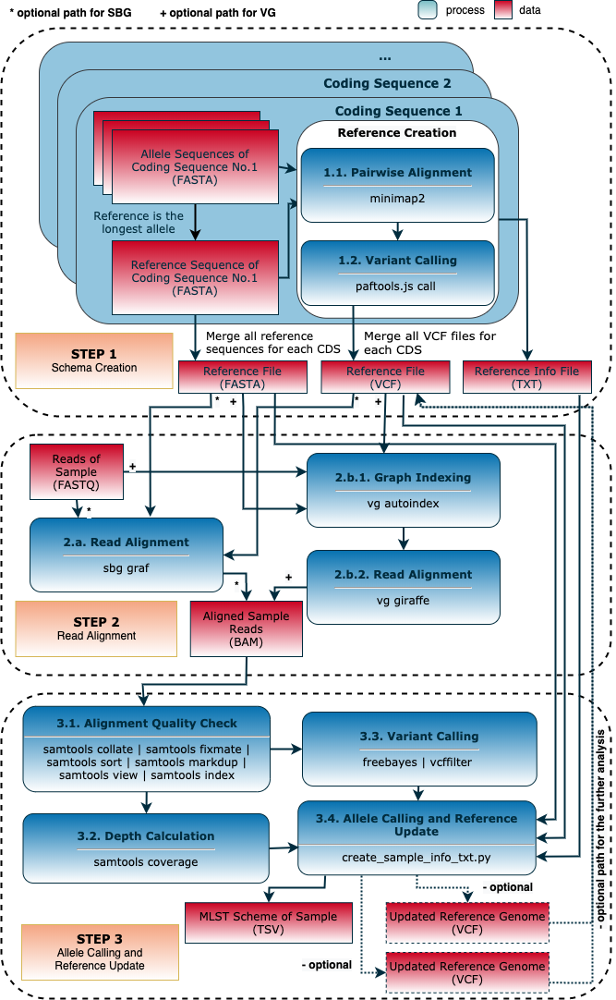
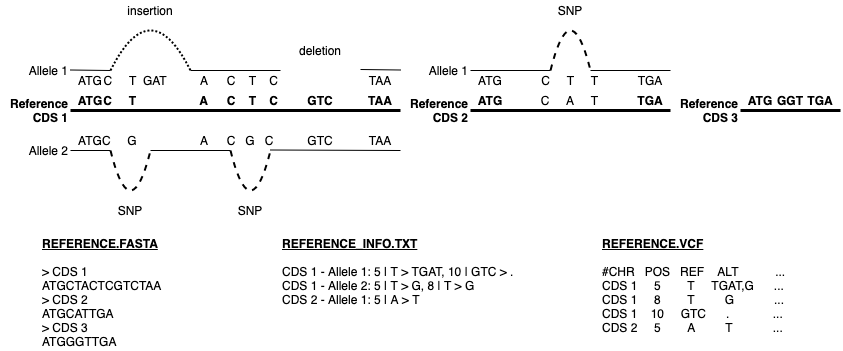
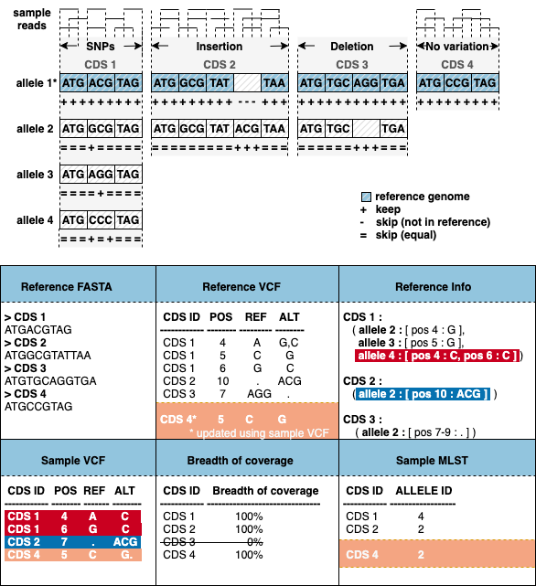
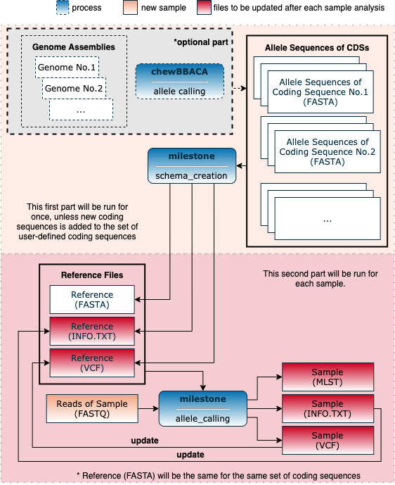

<div align="left"> <h1>  MILESTONE </h1> </div>

[](https://github.com/fatmakahveci/milestone/actions/workflows/tests.yml)

Milestone is a local `wgMLST` workflow for bacterial allele calling, profile comparison, schema QC, public schema import, and validation support.

If you are new to the project, start here:

- [What Milestone Is](/Users/fatmakhv/Desktop/milestone/docs/scientific-positioning.md)
- [How To Use Milestone](/Users/fatmakhv/Desktop/milestone/docs/how-to-use-milestone.md)
- [Milestone Compared With Other Tools](/Users/fatmakhv/Desktop/milestone/docs/competitive-analysis.md)

## Project Overview

Milestone covers the following core tasks:

- schema creation or import
- allele calling
- `wgMLST` profile comparison
- schema QC
- benchmarking and validation support
- local web-based demo and job execution

Useful reading:

- [competitive-analysis.md](/Users/fatmakhv/Desktop/milestone/docs/competitive-analysis.md)
- [scientific-positioning.md](/Users/fatmakhv/Desktop/milestone/docs/scientific-positioning.md)
- [how-to-use-milestone.md](/Users/fatmakhv/Desktop/milestone/docs/how-to-use-milestone.md)
- [methods-template.md](/Users/fatmakhv/Desktop/milestone/docs/methods-template.md)
- [limitations.md](/Users/fatmakhv/Desktop/milestone/docs/limitations.md)
Publication support files are available in [publication-checklist.md](/Users/fatmakhv/Desktop/milestone/docs/publication-checklist.md), [CITATION.cff](/Users/fatmakhv/Desktop/milestone/CITATION.cff), and [codemeta.json](/Users/fatmakhv/Desktop/milestone/codemeta.json).
An end-to-end manuscript preparation guide is available in [publication-runbook.md](/Users/fatmakhv/Desktop/milestone/docs/publication-runbook.md).
Publication-ready draft sections are available in [manuscript-sections.md](/Users/fatmakhv/Desktop/milestone/docs/manuscript-sections.md).
Candidate public sources for building larger benchmark packs are listed in [public-benchmark-datasets.md](/Users/fatmakhv/Desktop/milestone/docs/public-benchmark-datasets.md).
A lightweight documentation-led discoverability plan is available in [seo-playbook.md](/Users/fatmakhv/Desktop/milestone/docs/seo-playbook.md).
A static landing surface for indexing and search discovery now lives under [site/index.html](/Users/fatmakhv/Desktop/milestone/site/index.html).
External comparison-tool status and reproducible smoke commands are documented in [external-tool-benchmarking.md](/Users/fatmakhv/Desktop/milestone/docs/external-tool-benchmarking.md).
Installation notes for those external tools are documented in [external-tool-install.md](/Users/fatmakhv/Desktop/milestone/docs/external-tool-install.md).

Milestone also includes source-specific importer scripts for public benchmark and scheme assets:

- [import_pubmlst_benchmark_pack.py](/Users/fatmakhv/Desktop/milestone/workflow/scripts/import_pubmlst_benchmark_pack.py)
- [import_enterobase_scheme.py](/Users/fatmakhv/Desktop/milestone/workflow/scripts/import_enterobase_scheme.py)
- [freeze_public_benchmark_pack.py](/Users/fatmakhv/Desktop/milestone/workflow/scripts/freeze_public_benchmark_pack.py)
- [freeze_benchmark_pack_collection.py](/Users/fatmakhv/Desktop/milestone/workflow/scripts/freeze_benchmark_pack_collection.py)

The Streamlit app now exposes these importers through dedicated `PubMLST Packs` and `EnteroBase` tabs.
Scheduled CI now also includes an optional live public-import smoke job that exercises official PubMLST and EnteroBase endpoints when network access is available.

## Publication Readiness

Milestone now includes two CLI utilities aimed at manuscript-grade reproducibility:

- `publication_readiness`: checks whether schema QC, benchmark outputs, provenance, and reporting support files are present and internally consistent.
- `publication_package`: bundles the key artifacts, citation metadata, environment metadata, and a readiness summary into a ZIP archive suitable for supplementary material or lab archiving.

Example:

```bash
python workflow/milestone.py publication_readiness \
  --schema-qc-summary results/schema_qc/schema_qc_summary.json \
  --benchmark-summary results/benchmark/wgmlst_benchmark_summary.json \
  --schema-manifest results/schema/schema_manifest.json \
  --output results/publication_readiness

python workflow/milestone.py publication_package \
  --schema-qc-summary results/schema_qc/schema_qc_summary.json \
  --benchmark-summary results/benchmark/wgmlst_benchmark_summary.json \
  --schema-manifest results/schema/schema_manifest.json \
  --output results/milestone_publication_package.zip \
  --title "Milestone validation package"
```

These utilities strengthen reproducibility and reporting. They do not replace external biological validation or species-specific benchmarking.

Two additional utilities support manuscript preparation and validation corpus packaging:

- `validation_corpus`: builds a packaged species-level corpus from benchmark packs.
- `manuscript_supplement`: extracts a publication package into a supplement-ready directory tree.

Example:

```bash
python workflow/milestone.py validation_corpus \
  --collection-dir tests/fixtures/benchmark/public_species_packs \
  --output results/validation_corpus

python workflow/milestone.py manuscript_supplement \
  --publication-package results/milestone_publication_package.zip \
  --output results/manuscript_supplement
```

For a live PubMLST-backed workspace that builds frozen species packs and a corpus package in one pass:

```bash
python workflow/scripts/build_public_benchmark_workspace.py \
  --config configs/public_benchmark_workspace.example.json \
  --output-dir results/public_benchmark_workspace
```

For external comparison-tool smoke benchmarking in a containerized environment:

```bash
docker compose run --rm milestone-benchmark
```

## Publish the static site

The repository now includes a GitHub Pages workflow in [pages.yml](/Users/fatmakhv/Desktop/milestone/.github/workflows/pages.yml). It publishes the contents of [site](/Users/fatmakhv/Desktop/milestone/site/index.html) whenever `main` or `master` receives changes under `site/`.

To publish it:

1. Push this repository to GitHub.
2. In GitHub, open `Settings -> Pages`.
3. Set `Source` to `GitHub Actions`.
4. Push to `main` or run the `Publish Site` workflow manually.
5. Your site will appear under the repository's GitHub Pages URL, typically `https://<username>.github.io/<repo>/`.

## Web App Demo

Milestone now includes a lightweight Streamlit demo app in [webapp/app.py](/Users/fatmakhv/Desktop/milestone/webapp/app.py). This layer is intended for presentations, onboarding, and UI prototyping around the existing CLI workflow.

### Run the demo

```bash
python -m venv .venv
source .venv/bin/activate
pip install -r webapp/requirements.txt
streamlit run webapp/app.py
```

### Run with Docker

```bash
docker compose up --build
```

Lightweight UI only:

```bash
docker compose up --build milestone-web
```

Full workflow runtime with bioinformatics toolchain:

```bash
docker compose up --build milestone-runtime
```

### Import public wgMLST schemas

PubMLST/BIGSdb allele schemes can be imported into Milestone's schema layout:

```bash
python workflow/scripts/import_pubmlst_scheme.py \
  --database pubmlst_neisseria_seqdef \
  --list-schemes \
  --scheme-type wgmlst
```

```bash
python workflow/scripts/import_pubmlst_scheme.py \
  --database pubmlst_neisseria_seqdef \
  --scheme-id 1 \
  --output-dir schemas/neisseria_wgmlst \
  --include-profiles
```

You can also chain the imported public schema directly into Milestone reference generation:

```bash
python workflow/scripts/import_pubmlst_scheme.py \
  --database pubmlst_neisseria_seqdef \
  --scheme-id 1 \
  --scheme-type wgmlst \
  --output-dir schemas/neisseria_wgmlst \
  --run-schema-creation \
  --reference neisseria_public \
  --pipeline-output-dir output/neisseria_public \
  --threads 8
```

This writes one `<locus>.fasta` file per locus, plus `scheme_metadata.json` and optional `profiles.tsv`.
The Streamlit app exposes the same workflow in the `Public Schemas` tab.
Imported schemas now also include `scheme_manifest.json`, which records schema provenance, versioning, locus count, and expected schema type.

### Compare two wgMLST profiles

Milestone can now compare two finished wgMLST profiles and report whether they are:

- `different`: at least one comparable locus carries a different allele call
- `indistinguishable`: all comparable loci match and there are no unresolved loci
- `inconclusive`: profiles cannot be separated confidently because of missing or non-comparable calls

```bash
python workflow/milestone.py profile_compare \
  --profile-a output/run_a/vg/sample_a_wgmlst.tsv \
  --profile-b output/run_b/vg/sample_b_wgmlst.tsv \
  --label-a sample_a \
  --label-b sample_b \
  --output-dir output/compare/sample_a_vs_b
```

This writes `wgmlst_profile_summary.json` and `wgmlst_profile_comparison.tsv`. The Streamlit app exposes the same workflow in the `Strain Compare` tab.

Scientific note: this comparison layer is a wgMLST profile discriminator, not a phylogenetic distance estimator. A `different` result means the two isolates are distinguishable by at least one comparable locus; it does not claim how closely or distantly related they are evolutionarily.

Legacy comparison helpers now route through the same engine, so `compare_results.py` and `comp_milestone_chewie.py` no longer maintain separate comparison logic.

### Build a wgMLST distance matrix

Milestone can also summarize multiple profiles as a pairwise allele-distance matrix:

```bash
python workflow/milestone.py profile_matrix \
  --profiles output/run_a/vg/sample_a_wgmlst.tsv output/run_b/vg/sample_b_wgmlst.tsv output/run_c/vg/sample_c_wgmlst.tsv \
  --output output/compare/matrix_abc
```

This writes `wgmlst_distance_matrix.tsv` and `wgmlst_distance_summary.json`.
It also writes `wgmlst_distance_report.html` and a clustering summary inside the JSON output.

Milestone can also emit a batch pairwise decision table:

```bash
python workflow/milestone.py profile_compare_batch \
  --profiles output/run_a/vg/sample_a_wgmlst.tsv output/run_b/vg/sample_b_wgmlst.tsv output/run_c/vg/sample_c_wgmlst.tsv \
  --output output/compare/batch_abc
```

### Benchmark predicted profiles against a truth set

Milestone can benchmark a directory of predicted wgMLST profiles against truth-set profiles with matching sample names:

```bash
python workflow/milestone.py profile_benchmark \
  --predicted-dir output/predicted_profiles \
  --truth-dir validation/truth_profiles \
  --output output/benchmark_run
```

This writes `wgmlst_benchmark_summary.json`, `wgmlst_benchmark_per_sample.tsv`, `wgmlst_benchmark_per_locus.tsv`, and `wgmlst_benchmark_report.html`.
The repository includes a tiny reusable fixture package under [demo_species](/Users/fatmakhv/Desktop/milestone/tests/fixtures/benchmark/demo_species/README.md) for benchmark smoke tests and demos.

Milestone can also benchmark a directory of species packs:

```bash
python workflow/milestone.py profile_benchmark \
  --benchmark-pack-dir tests/fixtures/benchmark/public_species_packs \
  --output output/benchmark_species
```

This writes `wgmlst_benchmark_pack_summary.json`, `wgmlst_benchmark_species.tsv`, and `wgmlst_benchmark_collection_report.html`.

You can create a PubMLST-backed benchmark pack directly from isolate IDs:

```bash
python workflow/scripts/import_pubmlst_benchmark_pack.py \
  --scheme-database pubmlst_neisseria_seqdef \
  --isolate-database pubmlst_neisseria_isolates \
  --scheme-id 1 \
  --isolate-id 101 \
  --isolate-id 102 \
  --species "Neisseria meningitidis" \
  --output-dir benchmark_packs/neisseria_demo
```

To freeze the imported pack into a reproducible ZIP bundle for archival or supplementary material:

```bash
python workflow/scripts/freeze_public_benchmark_pack.py \
  --scheme-database pubmlst_neisseria_seqdef \
  --isolate-database pubmlst_neisseria_isolates \
  --scheme-id 1 \
  --isolate-id 101 \
  --output-dir benchmark_packs/neisseria_frozen
```

You can also download EnteroBase scheme-profile dumps:

```bash
python workflow/scripts/import_enterobase_scheme.py \
  --database senterica \
  --scheme-name wgMLST \
  --output-dir public_schemes/enterobase_senterica
```

### Run schema QC

Milestone can audit a schema directory before reference generation:

```bash
python workflow/scripts/schema_qc.py \
  --schema-dir tests/fixtures/smoke_schema \
  --output-dir output/schema_qc
```

This writes `schema_qc_summary.json` and `schema_qc_issues.tsv`.

### What the demo does

- Presents the existing two-stage workflow in a browser.
- Builds `schema_creation` and `allele_calling` commands from forms.
- Compares two wgMLST profiles and reports whether they are distinguishable.
- Shows expected output artifacts and mocked wgMLST results for demos.
- Supports both `Demo preview` and `Real run` modes.
- Keeps `Snakemake dry-run` enabled by default for safer first execution.
- Accepts optional schema FASTA and paired-end read uploads, storing them under `webapp_uploads/`.
- Starts real runs as background jobs with live status and log tailing in the sidebar.
- Exposes generated output files and ZIP bundles directly from the browser.
- Adds a `Schema QC` tab for locus-level schema validation.

### Notes on real execution

- `Real run` still depends on Snakemake and bioinformatics tools such as `bcftools`, `samtools`, `freebayes`, and `vg`.
- `Dockerfile` provides a lightweight UI image for preview and local orchestration.
- `Dockerfile.runtime` installs the full conda-based workflow toolchain from [workflow/environment.yml](/Users/fatmakhv/Desktop/milestone/workflow/environment.yml).
- Optional web authentication can be enabled with `MILESTONE_WEB_PASSWORD`.
- Upload size can be capped with `MILESTONE_MAX_UPLOAD_MB`.
- ORF validation supports explicit NCBI translation-table selection and optional start-codon overrides for species-specific schemas.
- Novel allele candidates are exported as `*_novel_alleles.fasta` and `*_novel_alleles.tsv` alongside the sample wgMLST output.
- The Streamlit app includes `Matrix`, `Benchmark`, and `Novel Alleles` tabs for heatmap-style comparison, truth-set validation, and inline export inspection.
- ORF validation now supports a larger set of NCBI translation tables, including tables `1`, `2`, `3`, `4`, `5`, `6`, `9`, `10`, `11`, `12`, `13`, `14`, `15`, `16`, `21`, `22`, `24`, and `25`.
- A lightweight multi-tool benchmark harness is available in [benchmark_typing_tools.py](/Users/fatmakhv/Desktop/milestone/workflow/scripts/benchmark_typing_tools.py) with reproducible configuration under [tool_profiles.json](/Users/fatmakhv/Desktop/milestone/benchmarking/tool_profiles.json).
- Additional executable benchmark profiles are documented in [benchmarking/README.md](/Users/fatmakhv/Desktop/milestone/benchmarking/README.md).

---

## Table of Contents

<!-- MarkdownTOC -->

- Milestone Workflow
  - Schema Creation
  - Allele Calling
- Citation

<!-- /MarkdownTOC -->

---

## Milestone Workflow

- Milestone has a fully-automated workflow.



### Schema Creation


- Milestone creates reference-related files:





**Details of \<reference\>_info.txt** Position (POS), reference (REF), alternate (ALT), and quality (QUAL) information of each variation are separated by specific characters in each line, where each variation of each allele is separated by comma(`,`) given in the same line (`cdsName_alleleId`).

- i.e. `cdsName_alleleId POS*REF>ALT-QUAL,POS*REF>ALT-QUAL`
  - Each comma-separated part `POS*REF>ALT-QUAL` represents a variation of an allele.
  - Each variation set on a line, `POS*REF>ALT-QUAL,POS*REF>ALT-QUAL` , represents an allele.
  - Each line represents a single allele of a single CDS.

### Allele Calling

- Milestone assigns the allele ID for sample's sequence aligned to the CDS based on the following criteria:
  - **<ID_from_the_reference>** If there is a complete match between the variations of sample's aligned sequence to the CDS and the allele-defining variation set given in TEXT-formatted reference file, it assigns the allele ID equal to the matching allele ID in the reference file.
  - **LNF** If the depth of coverage of the sample's CDS is lower than the expected, it assigns LNF (Locus Not Found) as allele ID to the sample's allele.
  - **<reference allele ID>** If the depth of coverage of the sample's aligned sequence is sufficient and the sample does not have any variations for the CDS locus, it assigns the allele ID of the schema's designated reference allele for that locus.
  - If there is no match between the variations of sample's aligned sequence and the allele-defining variation set given in TEXT-formatted reference file, it checks the validity of the sample's aligned sequence to the CDS before declaring the sequence as a novel allele of the CDS.
    - **LNF** If the sequence is not a multiple of 3 and/or contains an in-frame stop codon or invalid terminal coding structure, it assigns allele ID as LNF because the inferred coding sequence does not preserve an intact open reading frame.
    - **ASM** If the sequence passes the coding-sequence validation steps, but its length is smaller than 20\% below the locus allele length mode, it assigns ASM (Alleles Smaller than Mode) to the sample's allele.
    - **ALM** If the sequence passes the coding-sequence validation steps, but its length is larger than 20\% above the locus allele length mode, it assigns ALM (Alleles Larger than Mode) to the sample's allele.

- Scientific note: Milestone prefers allele `1` as the reference allele for each locus when present. If a locus FASTA does not contain allele `1`, schema creation falls back to the first FASTA record for that locus as the reference sequence, and allele calling/update logic follows that inferred reference consistently.
- Scientific note: the locus coverage cutoff is configurable through the CLI (`--min-locus-coverage`) because suitable breadth thresholds depend on schema design, sequencing depth, and species-specific validation.

- Reference update is described below:



---

<div align="left"> <h1> Tutorial </h1> </div>

This tutorial aims to create whole-genome multilocus sequence typing (wgMLST) profiles from the user-defined coding sequences and raw reads. Begin the tutorial by creating the environment for milestone run by following the instructions below.

---

## Table of Contents

<!-- MarkdownTOC -->

- 1. Setup
	- 1.1. Setting up the data for the tutorial
	- 1.2. Setting up the environment for the tutorial
		- Linux
			- i. Install pip \(Pip Installs Packages\) using APT \(Advanced Packaging Tool\)
			- ii. Install conda
			- iii. Create the conda environment
		- macOS
			- i. Install homebrew \(The Missing Package Manager\)
			- ii. Install pip \(Pip Installs Packages\) using homebrew
			- iii. Install conda
			- iv. Create the conda environment
	- 2.1. `milestone.py schema_creation`
		- a. From genome assemblies of species
		- b. From coding sequences
			- b.1. Only coding sequences are available in the initial set.
			- b.2. Coding sequences and their alleles are available in the initial set.
		- 2.1.1. Input files
		- 2.1.2. Parameters
			- 2.1.2.a. Milestone parameters
			- 2.1.2.b. Snakemake parameters \(*optional\)
		- 2.1.3. Output files
	- 2.2. `milestone.py allele_calling`
		- 2.2.1. Input files
		- 2.2.2. Parameters
			- 2.2.2.a. Milestone parameters
				- 2.2.2.a.1. VG
				- 2.2.2.a.2. SBG
			- 2.2.2.b. Snakemake parameters \(*optional\)
		- 2.2.3. Output files
			- 2.2.3.1. VG
			- 2.2.3.1. SBG

<!-- /MarkdownTOC -->

---

## 1. Setup

### 1.1. Setting up the data for the tutorial

- Create a directory *milestone_tutorial* for these exercises.

- Copy files from ... into *milestone_tutorial* directory.

### 1.2. Setting up the environment for the tutorial

---

#### Linux

##### i. Install [pip](https://packaging.python.org/tutorials/installing-packages/) (Pip Installs Packages) using APT (Advanced Packaging Tool)

- `sudo apt-get update`
- `sudo apt-get install python3-pip`

##### ii. Install [conda](https://conda.io/)

- Follow the instructions in [conda](https://conda.io/projects/conda/en/latest/user-guide/install/linux.html)'s website.

##### iii. Create the conda environment

```bash
conda config --add channels bioconda
conda config --add channels conda-forge
conda create --name milestone bcftools=1.13 biopython=1.79 chewbbaca=2.7.0 htslib=1.13 fastp=0.12 freebayes=1.3.2 minimap2=2.22 pysam=0.16.0.1 samtools=1.13 snakemake=5.32.2 vg=1.34
```

- You can activate the created environment to work in it:
  - `source activate milestone`
- When your analysis is done, you can deactivate the created environment:
  - `conda deactivate`
  - Your environment will be kept unless you remove it. You can use it again by activating with the line given above.

---

#### macOS

##### i. Install [homebrew](https://brew.sh) (The Missing Package Manager)

`/bin/bash -c "$(curl -fsSL https://raw.githubusercontent.com/Homebrew/install/HEAD/install.sh)"`

##### ii. Install [pip](https://packaging.python.org/tutorials/installing-packages/) (Pip Installs Packages) using homebrew

- `brew install python3.8`

##### iii. Install [conda](https://conda.io/)

- Follow the instructions in [conda](https://conda.io/projects/conda/en/latest/user-guide/install/macos.html)'s website.

##### iv. Create the conda environment

```bash
conda config --add channels bioconda
conda config --add channels conda-forge
conda create --name milestone bcftools=1.13 biopython=1.79 chewbbaca=2.7.0 htslib=1.13 fastp=0.12 freebayes=1.3.2 minimap2=2.22 pysam=0.16.0.1 samtools=1.13 snakemake=5.32.2 
```

- VG only have conda installation for Linux so you need to install VG to your local by following the steps in [VG](https://github.com/vgteam/vg#building-on-macos)'s website as an additional step.
- You can activate the created environment to work in it:
  - `source activate milestone`
- When your analysis is done, you can deactivate the created environment:
  - `conda deactivate`
  - Your environment will be kept unless you remove it. You can use it again by activating with the line given above.

---

- Milestone runs in two modes:

1. `python milestone.py schema_creation`
2. `python milestone.py allele_calling`

---

### 2.1. `milestone.py schema_creation`

- Milestone creates `Snakefile` file so it doesn't require to use `--snakefile SNAKEFILE` parameter. Only if you definitely want a different layout, you need to use this parameter.
- Milestone creates `config.yaml` files so you should not create this file.

---

#### a. From genome assemblies of species

- You can use [chewBBACA](https://github.com/B-UMMI/chewBBACA) to call alleles using public or user-provided genome assemblies belonging to the species.

- If you prefer using public genome assemblies of the species of the interest, you can download the public data by running `download_species_reference_fasta.sh`  script with the command below:

  `bash download_species_reference_fasta.sh -s <species_name>`

---

#### b. From coding sequences

##### b.1. Only coding sequences are available in the initial set.

- It appends all the coding sequences to create `<reference.fasta>` file.
- It creates an empty `<reference_info.txt>` file for further analysis.
- It creates a `<reference.vcf>` file containing only a default header for further analysis.

##### b.2. Coding sequences and their alleles are available in the initial set.

- It appends all the coding sequences to create `<reference.fasta>` file.
- It creates a `<reference_info.txt>` file to identify the allele set of user-provided coding sequences for further analysis.
- It creates a `<reference.vcf>` file containing a default header and variations between alleles and their reference coding sequences for further analysis.

---

#### 2.1.1. Input files

```pseudocode
schema_name
|- CDS1.fasta
|- CDS2.fasta
|- ...
|- CDSn.fasta
```

---

#### 2.1.2. Parameters

##### 2.1.2.a. Milestone parameters

```pseudocode
--reference <reference>
		Name of reference file to be given without extension and directory. It will be used to name <reference>.fasta, <reference>.vcf, and <reference>_info.txt files. [required: True]

--threads <threads>
		Number of threads to be used in the workflow. [default: 1]

--schema_name <schema_name>
		Name of directory containing user-defined coding sequences and their alleles. [required: True]

--output <output_directory>
		Name of directory for the output reference files. [required: True]
```

##### 2.1.2.b. Snakemake parameters (*optional)

```pseudocode
--help
		Show this help message and exit.

--dryrun
		Display the commands without running. [default: False]
		
--unlock
		Removes possible locks on Snakemake. [default: False]

--quiet
		Do not output any progress. [default: False]

--rerun-incomplete
		Rerun all incomplete jobs. [default: False]

--forceall
		Run all rules independent of being already created output. [default: False]

--printshellcmds
		Prints the shell command to be executed. [default: False]
```

---

#### 2.1.3. Output files

```pseudocode
output_directory
|- <reference>.fasta
|- <reference>.vcf.gz
|- <reference>_info.txt
```

---

### 2.2. `milestone.py allele_calling`

---

#### 2.2.1. Input files

- `schema_name` will only be used to add novel allele sequences identified using the analyzed sample.
- Allele info for the reference is already available in `<reference>_info.txt` file.

```pseudocode
output_directory
|- <reference>.fasta
|- <reference>.vcf.gz
|- <reference>_info.txt

<sample_read1>

<sample_read2>

schema_name
|- CDS1.fasta
|- CDS2.fasta
|- ...
|- CDSn.fasta
```

---

#### 2.2.2. Parameters

##### 2.2.2.a. Milestone parameters

###### 2.2.2.a.1. VG

```pseudocode
--aligner vg

--read1 <sample_read1>
		First read of sample including its directory. [required: True]

--read2 <sample_read2>
		Second read of sample including its directory. [required: True]

--reference <reference>
		Name of reference file to be given without extension and directory. It will be used to name <reference>.fasta, <reference>.vcf, and <reference>_info.txt files. [required: True]

--threads <threads>
		Number of threads to be used in the workflow. [default: 1]

--schema_name <schema_name>
		Name of directory containing user-defined coding sequences and their alleles. [required: True]

--output <output_directory>
		Name of directory for the output reference files. [required: True]

--update_reference
		Updates <reference>_info.txt and <reference>.vcf files by adding the information coming from the analyzed sample. [default: False]
```

###### 2.2.2.a.2. SBG

```pseudocode
--aligner sbg

--read1 <sample_read1>
		First read of sample including its directory. [required: True]

--read2 <sample_read2>
		Second read of sample including its directory. [required: True]

--reference <reference>
		Name of reference file to be given without extension and directory. It will be used to name <reference>.fasta, <reference>.vcf, and <reference>_info.txt files. [required: True]

--threads <threads>
		Number of threads to be used in the workflow. [default: 1]

--schema_name <schema_name>
		Name of directory containing user-defined coding sequences and their alleles. [required: True]

--output <output_directory>
		Name of directory for the output reference files. [required: True]

--update_reference
		Updates <reference>_info.txt and <reference>.vcf files by adding the information coming from the analyzed sample. [default: False]
```

##### 2.2.2.b. Snakemake parameters (*optional)

```pseudocode
--help
		Show this help message and exit.

--dryrun
		Display the commands without running. [default: False]
		
--unlock
		Removes possible locks on Snakemake. [default: False]

--quiet
		Do not output any progress. [default: False]

--rerun-incomplete
		Rerun all incomplete jobs. [default: False]

--forceall
		Run all rules independent of being already created output. [default: False]

--printshellcmds
		Prints the shell command to be executed. [default: False]
```

---

#### 2.2.3. Output files

- If `--update_reference` parameter is used, `<reference>_info.txt` and `<reference.vcf>` will be updated. (Note: `<reference>.fasta` is not required to be updated because the references of coding sequences will remain the same.)
- Files in `vg` or `sbg` are created from the scratch , but the remaining files are the updated versions of the input files.

##### 2.2.3.1. VG

```pseudocode
output_directory
|- <reference>_info.txt
|- <reference>.fasta
|- <reference>.vcf
|- vg
|--- <sample>.vcf
|--- <sample>_wgmlst.tsv
|--- <sample>.bam
|--- <sample>.depth

schema_name
|- CDS1.fasta
|- CDS2.fasta
|- ...
|- CDSn.fasta
```

##### 2.2.3.1. SBG

```pseudocode
output_directory
|- <reference>_info.txt
|- <reference>.fasta
|- <reference>.vcf
|- sbg
|--- <sample>.vcf
|--- <sample>_wgmlst.tsv
|--- <sample>.bam
|--- <sample>.depth

schema_name
|- CDS1.fasta
|- CDS2.fasta
|- ...
|- CDSn.fasta
```

---

## Citation
Citation details are not yet defined in this repository snapshot.
